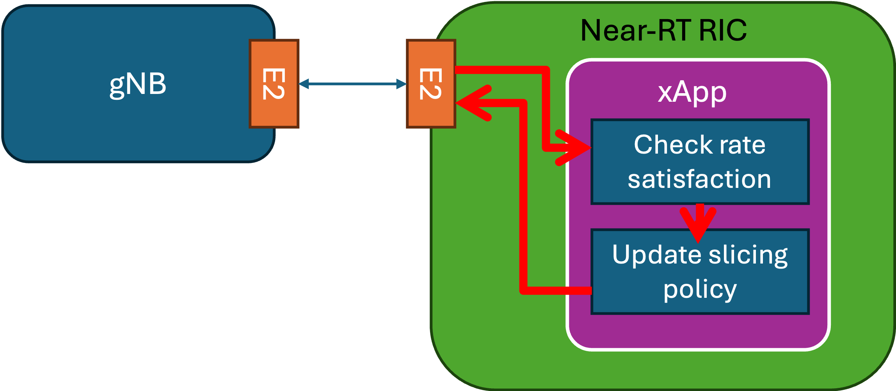
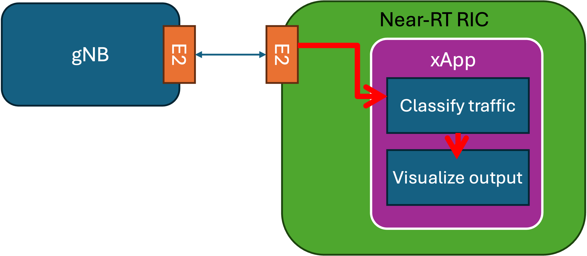

# Assignments

You can use the 'sample xApp' available in [this repository](https://github.com/wineslab/colosseum-near-rt-ric) and this [OpenRAN Gym tutorial](https://openrangym.com/tutorials/scope-coloran-o-ran) as template for the xApps and guide for the assignments.

## Assignment 1: Create a Slicing Control xApp

  

- **Objective**: Develop an xApp with basic PRB increase/decrease policy to satisfy a certain minimum throughput.
- **Requirements**:
  - The xApp should dynamically adjust the PRBs to meet a minimum throughput requirement for two UEs. You will use `iperf` to change the amount of traffic generated by each user in real time. It is required that you set a minimum throughput requirement below `4Mbps` (a safe range of values is in `(0,2] Mbps`. It is expected that no changes to the PRB number is performed if the minimum rate requirement is met, but PRB number for an unsitisfied UE needs to increase when the rate requirement is not met.  
  - The PRB adjustments should be incremental, with increases or decreases of +3 or -3 (i.e. 1 RBG) at a time. The change should be made at regular intervals (e.g. every 5 s).
- **Details**:
  - To read the KPMs streamed by the gNB to the xApp, you will use the
    - `[TODO: add details on how to read KPMs in the xApp]`
  - To change the number of PRBs allocated to each UE you will use the following piece of code inside the xApp code
    - `[TODO: add details on how to change slice number]`
  - Your objective is to read throughput measurements for each UE (e.g., `tx_brate downlink [Mbps]` column in the `*_metrics.csv` file), and adjust the number of PRBs to meet the minimum rate requirement. 

## Assignment 2: Create a Traffic Classification xApp

  

- **Objective**: Develop an xApp that receives E2 data and classifies the type of traffic.
- **Requirements**:
  - The xApp should dynamically identify the type of traffic being generated by the UEs. You will use `iperf` to change the amount of traffic generated by each user in real time.
  - You will generate at least two traffic profiles (e.g., `low bit rate` and `high bit rate`), and develop logic to identify which class of traffic is being generated by the UEs. You can assume that all UEs generate the same type of traffic at the same time. Do not generate traffic that is higher than `4Mbps` (a max of `2Mbps` is suggested).
- **Details**:
  - The xApp should be capable of differentiating between two types of traffic: low throughput and high throughput.
  - The classification should be adaptive, considering the variable nature of `iperf` traffic.
  - To read the KPMs streamed by the gNB to the xApp, you will use the
    - `[TODO: add details on how to read KPMs in the xApp]`
  - You are free to decide how to visualize the output of the classification output.
