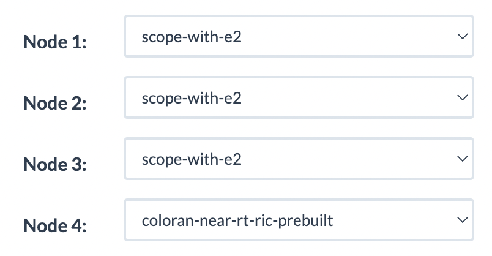

# LipariSchool2024
Tutorial for end-to-end O-RAN deployment and AI development for the Lipari Summer School 2024.


# O-RAN Tutorial Assignment

In this tutorial, you will learn how to (i) access and make a reservation on Colosseum; (ii) use the SCOPE [[1]](#cite_scope) and ColO-RAN [[2]](#cite_coloran) components of OpenRAN Gym [[3]](#cite_openrangym) to develop O-RAN-compliant Artificial Intelligence (AI)/Machine Learning (ML) solutions; and (iii) deploy them as xApps on the near-RT RAN Intelligent Controller (RIC). In this tutorial, we are going to use 4 nodes, representing one Base Station (BS), two users (UE) and the near-RT RIC. You will learn how to collect data on Colosseum, perform data analysis and design AI-based xApps that perform either forecasting or real-time RAN control of network slicing strategies.


## Important information regarding your credentials to access Colosseum

We have pre-allocated 10 accounts exclusively dedicated to the school. Each account follows the nomenclature `liparischool<X>`, where `<X>` is a number from 1 to 10. For instance, the account for team 5 is `liparischool5`. Please take notice of the team number assigned to you, it will be necessary to access your team account on Colosseum. The password for all team accounts will be provided during the tutorial. If you do not know which team number has been assigned to you, please ask one of the instructors. Credentials to access the Colosseum documentation on Freshdesk [[3]](#cite_freshdesk) (i.e., Colosseum helpdesk) will also be provided during the tutorial.

NOTE: In some portions of the tutorial (e.g., when asked to login into the VPN, a couple of lines below), your credentials will also be referred to as LDAP username and password.


## Make a reservation on Colosseum

1. Connect to Colosseum VPN (instructions [here](https://colosseumneu.freshdesk.com/support/solutions/articles/61000285824-cisco-anyconnect-remote-vpn-access)), login to [Colosseum website](https://experiments.colosseum.net), and upload your SSH public key (instructions [here](https://colosseumneu.freshdesk.com/support/solutions/articles/61000253402-upload-ssh-public-keys)). Please note that only a single SSH key is supported at this time.
2. Complete the setup instructions [here](https://colosseumneu.freshdesk.com/support/solutions/articles/61000253369-ssh-proxy-setup).
3. Make a reservation with four Colosseum nodes, called SRNs (see instructions on [Making a Reservation](https://colosseumneu.freshdesk.com/en/support/solutions/articles/61000253463-making-a-reservation-interactive-and-batch-mode-)). The order of the SRNs shall be the following: for the first three SRNs choose the `scope-with-e2` image, while for the forth choose the `coloran-near-rt-ric-prebuilt` image. It is noted that the RIC should be allocated to the last SRN in the Colosseum reservation. Below you find an **example** with one BS, one UE, and the RIC. You will need 4 SRNs: 1 BS , 2 UEs, 1 RIC (3x `scope-with-e2` images, 1 `coloran-near-rt-ric-prebuilt` image).

    <p align="center">
      
    </p>

4. On the reservation page, you can find the assigned SRNs/nodes and their hostnames by hovering over the nodes.
5. At your scheduled reservation time, open five terminals. Two for the SCOPE BS, one for each SCOPE UE (i.e., two), and one for the RIC. In each terminal, SSH as `root` user into the assigned Colosseum SRNs: `ssh root@<srn-hostname>`. The password for the `scope-with-e2` container is `scope`, while for the `coloran-near-rt-ric-prebuilt` image, the password is `ChangeMe`. In **_any_** of the terminals, run the following command to start a Colosseum Radio-frequency (RF) scenario through the Colosseum CLI API (see instructions [here](https://colosseumneu.freshdesk.com/en/support/solutions/articles/61000253397-colosseum-cli)): `colosseumcli rf start 1009 -c`. More information about the scenario can be found in [Test Scenario All Paths 0 dB (1009)](https://colosseumneu.freshdesk.com/support/solutions/articles/61000277641-test-scenario-all-paths-0-db-1009). When the scenario starts, an output similar to the following is returned (time is in UTC):


```
Scenario Start Time is 22:30:45
```

```
TODO: reference to other readme files
```


# References

<a id="cite_scope">[1]</a> https://openrangym.com/ran-frameworks/scope

<a id="cite_coloran">[2]</a> https://openrangym.com/o-ran-frameworks/coloran

<a id="cite_openrangym">[3]</a> https://openrangym.com/

<a id="cite_freshdesk">[3]</a> https://colosseumneu.freshdesk.com
