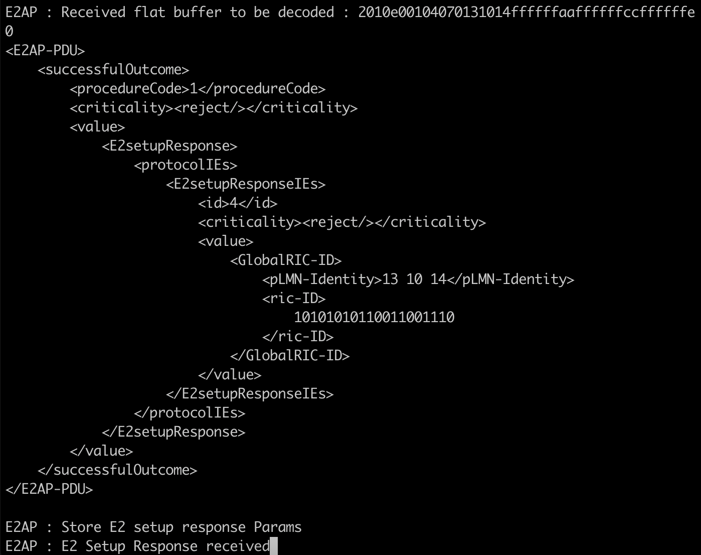

# Near-real-time RIC and xApp

## Start the ColO-RAN Near-RT RIC

Now we start the ColO-RAN near-RT RIC. **On the SRN with the ColO-RAN image**, and its respective terminal, type the following commands. You need to specify the network interface used by the RIC to communicate with the RAN (e.g., the `col0` interface in Colosseum). These commands will build and start the Docker images of the ColO-RAN near-RT RIC.

```bash
cd ~/radio_code/colosseum-near-rt-ric/setup-scripts
./setup-ric.sh col0
```

The Docker containers composing the near-RT RIC are imported (if not present already) and started, and their IP addresses and ports (defined in the `setup-lib.sh` script) are configured. These images include:

- `e2term`: This is the endpoint of the E2 messages on the RIC.
- `e2mgr`: It manages the messages to/from the E2 interface.
- `e2rtmansim`: It leverages the RIC Message Router (RMR) protocol to route the E2 messages inside the RIC.
- `db`: It maintains a database of the RAN nodes connected to the RIC.

At this time, the `e2term` container will listen for incoming connections from RAN nodes implementing an E2 termination endpoint. The container logs can be optionally read through the `docker logs` command, e.g., `docker logs e2term -f` shows the logs of the E2 termination (`e2term`) container.

After the previous step is done (i.e., setting up the RIC), type 

```bash
ifconfig col0
```
and write down (i.e., in a text editor) the IP address of the `col0` interface since we will need it in the next step.


## Connect the SCOPE Base Station to ColO-RAN Near-RT RIC

After the ColO-RAN neat-RT RIC is started following the previous steps, the SCOPE base station can be connected to it. To achieve this, the SCOPE base station runs an instance of the O-RAN E2 termination, which we adapted from the O-RAN Software Community (OSC) Distributed Unit (DU) implementation. Once connected to the near-RT RIC, this component can exchange messages with the xApps running within.

Specifically, the E2 termination of the base station can:

- Receive RIC Subscription messages from the xApps.
- Send periodic RAN Key Performance Measurements (KPMs) to the xApps through RIC Indication messages.
- Receive RIC Control messages from the xApps.
- Interface with the SCOPE Application Programming Interfaces (APIs) to modify the scheduling and slicing configurations of the base station based on the received xApp control.

To include the IP address of the ColO-RAN node (e.g., the `col0` interface of the ColO-RAN node in Colosseum), we modify the `build_odu.sh` script. On the second terminal of the SCOPE BS, which corresponds to the first node of our reservation, we do the following:

```bash
cd ~/radio_code/colosseum-scope-e2
vim build_odu.sh
```

In `<insert-ric-ip-address-here>` type the output of the `ifconfig col0` of the previous step. To edit a file with `vim` we type `i` and continue editing the file.

```sh
export RIC_HOST="<insert-ric-ip-address-here>"
export RIC_PORT=36422
export INTERFACE_TO_RIC="col0"
export JSON_FORMAT=0
export DEBUG=0
```

Save the changes (press `ESC` and then `:wq` or `ZZ`) in the file above and initialize the E2 termination on the SCOPE base station by typing the following commands on the SCOPE node. To revoke any unwanted changes in the `build_odu.sh` script type `ESC` and then `:q!`.

```bash
./build_odu.sh clean
./run_odu.sh
```

The E2 termination is first built through the `build_odu.sh` script, which also sets the IP address and port of the near-RT RIC to connect to, as well as the network interface used for the connection to the RIC. Then, the E2 termination can be started through the `run_odu.sh` script, which initializes the E2 termination and connects it to the near-RT RIC. The successful connection of base station and near-RT RIC can be verified by reading the logs of the e2term container on the ColO-RAN node (e.g., through the command docker `logs e2term -f | grep gnb`). This log shows the association messages between the RIC and the base station, together with the ID of the connected base stations (e.g., `gnb:311-048-02010501`).

A successful setup of the BS's O-DU will result in the following output.

<p align="center">
  
</p>


## Initialize a Sample xApp

As a first step, on the SRN terminal with the ColO-RAN image, we type `docker logs e2term -f | grep gnb`, stop the process (`Ctrl + C`) and search (`Ctrl + F`) for the `gnb:` ID entry. An example is the following: `gnb:311-048-02010501`. We write down the GNB ID (i.e., in a text editor). 

After starting the near-RT RIC, and connecting the SCOPE base station to it, the sample xApp provided as part of ColO-RAN can be initialized. This can be done through the `setup-sample-xapp.sh` script by typing the following commands **on the ColO-RAN node** and the respective terminal. This script takes as input the ID of the RAN node the xApp subscribes to (e.g., the base station), which can be read in the logs of the ColO-RAN e2term Docker container, as described in the previous sections. It then builds the Docker image of the sample xApp, and starts it as a Docker container on the near-RT RIC.

```bash
cd ~/radio_code/colosseum-near-rt-ric/setup-scripts
./setup-sample-xapp.sh <GNB ID>
```

For example: `./setup-sample-xapp.sh gnb:311-048-02010501`.

After the xApp container (named, for instance `sample-xapp-24`) has been started, the xApp process can be run with the following command. By running this command, the xApp subscribes to the RAN node specified in the xApp build script above (through a RIC Subscription message), and triggers periodic reports (sent through RIC Indication messages) of RAN KPMs from the node.

```bash
docker exec -it sample-xapp-24 /home/sample-xapp/run_xapp.sh
```
 
 After performing these steps, the ColO-RAN sample xApp logs on file the KPMs received from the RAN node. Users can add custom intelligence (e.g., through AI/ML agents) to the xApp by modifying the template scripts in the `setup/sample-xapp/` directory, deleting the existing xApp Docker image, and rebuilding it through the steps described in this section.


## Change the ODU Report Timer

To change the O-DU report timer, we first stop (`Ctrl + C`) the processes on both the DU side of the SCOPE BS and the near-RT RIC. Then, we can type the following commands on the SRN terminal with the ColO-RAN image:

```bash
 docker exec -it sample-xapp-24 /bin/bash
 sed -i 's/std::string event_def = "250"/std::string event_def = "1000"/' src/xapp.cc
```

With the above changes, we modify the timescale at which the BS's O-DU reports the RAN metrics to the RIC. The initial granularity was set to 250 ms, and now we modify it to 1000 ms. Finally, we build the xApp code, as following `./build_xapp.sh clean`.

We restart the ODU with `./run_odu.sh` (on the second terminal of the SCOPE BS) and we restart the xApp with the following command from within the Docker container:

```bash
 cd ../sample-xapp
 ./run_xapp.sh
```